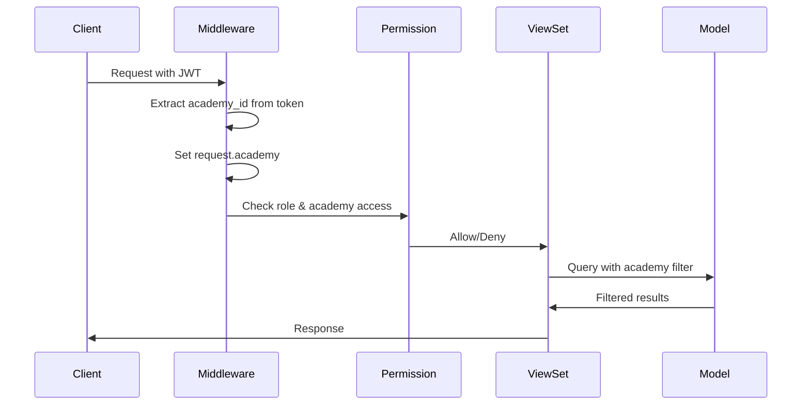
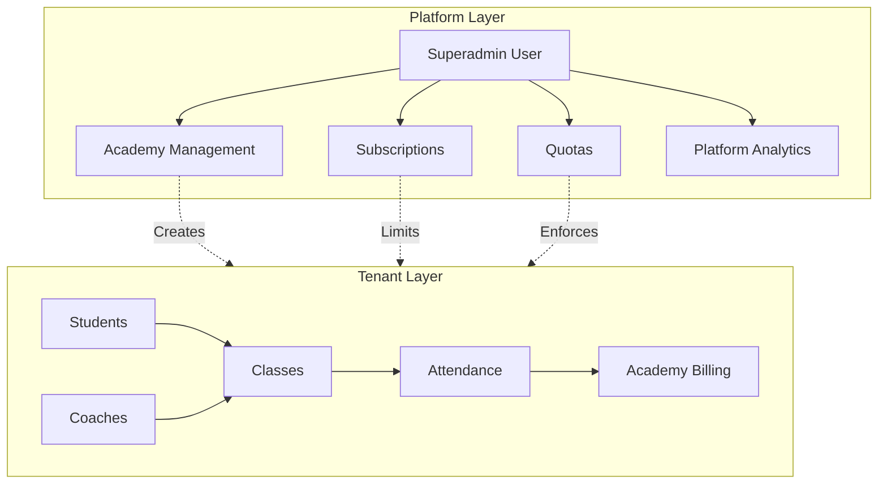

# System Architecture

## Overview

This document defines the complete system architecture for the Sports Academy Management System, a multi-tenant SaaS platform. The architecture strictly separates platform-level operations from tenant-level operations to ensure proper isolation and scalability.

## Architecture Principles

### Platform vs Tenant Separation

The system is divided into two distinct layers that must never mix:

- **Platform Layer**: Handles superadmin operations, tenant (academy) management, subscriptions, quotas, and system-wide analytics. This layer operates at the global level and manages the SaaS infrastructure.

- **Tenant Layer**: Handles academy-specific operations including students, classes, coaches, attendance, billing, and reports. This layer is fully isolated per academy using `academy_id`.

**Critical Rule**: Platform models MUST NOT contain tenant business logic, and tenant models MUST NOT access platform-wide data.

### Multi-Tenancy Model

- **Single Database**: All tenants share one PostgreSQL database
- **Row-Level Isolation**: Every tenant model includes `academy = ForeignKey(Academy, on_delete=CASCADE)`
- **Automatic Filtering**: All tenant queries are automatically filtered by `request.academy`
- **Superadmin Bypass**: Superadmin can access all academies for read-only management purposes only
- **No Cross-Tenant Access**: Strict enforcement prevents data leakage between tenants

## Backend Django Structure

```
backend/
├── config/                 # Django project configuration
│   ├── settings/
│   │   ├── base.py         # Base settings (shared)
│   │   ├── development.py  # Development overrides
│   │   ├── production.py   # Production overrides
│   │   └── testing.py       # Test overrides
│   ├── urls.py             # Root URL configuration
│   └── wsgi.py             # WSGI application
│
├── platform/               # Platform layer apps (NO tenant logic)
│   ├── accounts/           # Superadmin user management
│   │   ├── models.py       # Superadmin user model
│   │   ├── views.py        # Authentication views
│   │   ├── serializers.py  # User serializers
│   │   └── urls.py         # Auth endpoints
│   │
│   ├── tenants/            # Academy model & management
│   │   ├── models.py       # Academy model
│   │   ├── views.py        # Academy CRUD (Superadmin only)
│   │   ├── serializers.py  # Academy serializers
│   │   ├── services.py     # Academy business logic
│   │   └── urls.py         # Academy endpoints
│   │
│   ├── subscriptions/       # Plans, subscriptions, billing
│   │   ├── models.py       # Plan, Subscription models
│   │   ├── views.py        # Subscription management
│   │   ├── serializers.py  # Subscription serializers
│   │   └── urls.py         # Subscription endpoints
│   │
│   ├── quotas/             # Quota tracking & enforcement
│   │   ├── models.py       # Quota, TenantUsage models
│   │   ├── views.py        # Quota management
│   │   ├── services.py     # Quota calculation & enforcement
│   │   └── urls.py         # Quota endpoints
│   │
│   └── analytics/          # Platform-wide analytics
│       ├── models.py       # Analytics aggregation models
│       ├── views.py        # Analytics endpoints
│       └── services.py     # Analytics calculation
│
├── tenant/                  # Tenant layer apps (academy-scoped)
│   ├── onboarding/         # Onboarding wizard
│   │   ├── models.py       # Onboarding state model
│   │   ├── views.py        # Wizard step endpoints
│   │   ├── serializers.py  # Wizard serializers
│   │   ├── services.py     # Completion validation
│   │   └── urls.py         # Onboarding endpoints
│   │
│   ├── students/           # Student management
│   │   ├── models.py       # Student model (has academy FK)
│   │   ├── views.py        # Student CRUD
│   │   ├── serializers.py  # Student serializers
│   │   ├── services.py     # Student business logic
│   │   └── urls.py         # Student endpoints
│   │
│   ├── coaches/            # Coach management
│   │   ├── models.py       # Coach model (has academy FK)
│   │   ├── views.py        # Coach CRUD
│   │   ├── serializers.py  # Coach serializers
│   │   └── urls.py         # Coach endpoints
│   │
│   ├── classes/            # Class scheduling
│   │   ├── models.py       # Class, Enrollment models (has academy FK)
│   │   ├── views.py        # Class CRUD
│   │   ├── serializers.py  # Class serializers
│   │   └── urls.py         # Class endpoints
│   │
│   ├── attendance/         # Attendance tracking
│   │   ├── models.py       # Attendance model (has academy FK)
│   │   ├── views.py        # Attendance CRUD
│   │   ├── serializers.py  # Attendance serializers
│   │   └── urls.py         # Attendance endpoints
│   │
│   ├── billing/            # Academy billing
│   │   ├── models.py       # Invoice, Payment models (has academy FK)
│   │   ├── views.py        # Billing endpoints
│   │   ├── serializers.py  # Billing serializers
│   │   └── urls.py         # Billing endpoints
│   │
│   ├── media/              # Media file management
│   │   ├── models.py       # MediaFile model (has academy FK)
│   │   ├── views.py        # Media upload/download
│   │   ├── services.py     # S3 integration, storage tracking
│   │   └── urls.py         # Media endpoints
│   │
│   └── reports/            # Academy reports
│       ├── models.py       # Report model (has academy FK)
│       ├── views.py        # Report generation
│       ├── services.py     # Report calculation
│       └── urls.py         # Report endpoints
│
├── shared/                 # Shared utilities (used by both layers)
│   ├── middleware/         # Custom middleware
│   │   ├── tenant.py       # Tenant resolution middleware
│   │   ├── onboarding.py   # Onboarding check middleware
│   │   └── quota.py        # Quota enforcement middleware
│   │
│   ├── permissions/        # Permission classes
│   │   ├── __init__.py
│   │   ├── platform.py     # Platform permissions
│   │   └── tenant.py       # Tenant permissions
│   │
│   ├── services/           # Shared services
│   │   ├── email.py        # Email service
│   │   ├── storage.py      # S3 storage service
│   │   └── quota.py        # Quota calculation service
│   │
│   ├── utils/              # Common utilities
│   │   ├── exceptions.py   # Custom exceptions
│   │   └── helpers.py      # Helper functions
│   │
│   └── validators/         # Shared validators
│       └── validators.py   # Custom field validators
│
├── celery_app/             # Celery configuration
│   ├── __init__.py
│   ├── celery.py           # Celery app instance
│   └── tasks.py            # Async tasks
│
├── requirements.txt         # Python dependencies
├── manage.py               # Django management script
└── Dockerfile              # Container definition
```

## Frontend React/Vite Structure (Hybrid)

The frontend uses a hybrid structure combining feature-based organization with shared layers:

```
frontend/
├── public/                 # Static assets
│   ├── favicon.ico
│   └── index.html
│
├── src/
│   ├── features/           # Feature-based modules (domain logic)
│   │   ├── platform/       # Platform features
│   │   │   ├── tenants/
│   │   │   │   ├── components/
│   │   │   │   │   ├── AcademyList.tsx
│   │   │   │   │   ├── AcademyForm.tsx
│   │   │   │   │   └── AcademyCard.tsx
│   │   │   │   ├── hooks/
│   │   │   │   │   └── useAcademies.ts
│   │   │   │   ├── services/
│   │   │   │   │   └── academyService.ts
│   │   │   │   ├── types/
│   │   │   │   │   └── academy.types.ts
│   │   │   │   ├── pages/
│   │   │   │   │   └── AcademyManagement.tsx
│   │   │   │   └── index.ts
│   │   │   │
│   │   │   ├── subscriptions/
│   │   │   │   ├── components/
│   │   │   │   ├── hooks/
│   │   │   │   ├── services/
│   │   │   │   ├── types/
│   │   │   │   ├── pages/
│   │   │   │   └── index.ts
│   │   │   │
│   │   │   └── analytics/
│   │   │       ├── components/
│   │   │       ├── hooks/
│   │   │       ├── services/
│   │   │       ├── types/
│   │   │       ├── pages/
│   │   │       └── index.ts
│   │   │
│   │   ├── tenant/         # Tenant features
│   │   │   ├── onboarding/
│   │   │   │   ├── components/
│   │   │   │   │   ├── WizardStepper.tsx
│   │   │   │   │   ├── ProfileStep.tsx
│   │   │   │   │   ├── LocationStep.tsx
│   │   │   │   │   └── SportStep.tsx
│   │   │   │   ├── hooks/
│   │   │   │   │   └── useOnboarding.ts
│   │   │   │   ├── services/
│   │   │   │   │   └── onboardingService.ts
│   │   │   │   ├── types/
│   │   │   │   │   └── onboarding.types.ts
│   │   │   │   ├── pages/
│   │   │   │   │   └── OnboardingWizard.tsx
│   │   │   │   └── index.ts
│   │   │   │
│   │   │   ├── students/
│   │   │   │   ├── components/
│   │   │   │   ├── hooks/
│   │   │   │   ├── services/
│   │   │   │   ├── types/
│   │   │   │   ├── pages/
│   │   │   │   └── index.ts
│   │   │   │
│   │   │   ├── coaches/
│   │   │   │   ├── components/
│   │   │   │   ├── hooks/
│   │   │   │   ├── services/
│   │   │   │   ├── types/
│   │   │   │   ├── pages/
│   │   │   │   └── index.ts
│   │   │   │
│   │   │   ├── classes/
│   │   │   │   ├── components/
│   │   │   │   ├── hooks/
│   │   │   │   ├── services/
│   │   │   │   ├── types/
│   │   │   │   ├── pages/
│   │   │   │   └── index.ts
│   │   │   │
│   │   │   ├── attendance/
│   │   │   │   ├── components/
│   │   │   │   ├── hooks/
│   │   │   │   ├── services/
│   │   │   │   ├── types/
│   │   │   │   ├── pages/
│   │   │   │   └── index.ts
│   │   │   │
│   │   │   └── billing/
│   │   │       ├── components/
│   │   │       ├── hooks/
│   │   │       ├── services/
│   │   │       ├── types/
│   │   │       ├── pages/
│   │   │       └── index.ts
│   │   │
│   │   └── auth/           # Authentication feature
│   │       ├── components/
│   │       │   ├── LoginForm.tsx
│   │       │   └── ProtectedRoute.tsx
│   │       ├── hooks/
│   │       │   └── useAuth.ts
│   │       ├── services/
│   │       │   └── authService.ts
│   │       ├── types/
│   │       │   └── auth.types.ts
│   │       ├── pages/
│   │       │   ├── Login.tsx
│   │       │   └── Register.tsx
│   │       └── index.ts
│   │
│   ├── shared/             # Shared layers (reusable across features)
│   │   ├── components/     # Reusable UI components
│   │   │   ├── ui/         # Base UI components (shadcn)
│   │   │   │   ├── button/
│   │   │   │   ├── form/
│   │   │   │   ├── input/
│   │   │   │   ├── modal/
│   │   │   │   └── table/
│   │   │   │
│   │   │   ├── layout/     # Layout components
│   │   │   │   ├── Header.tsx
│   │   │   │   ├── Sidebar.tsx
│   │   │   │   └── Footer.tsx
│   │   │   │
│   │   │   └── common/     # Common components
│   │   │       ├── LoadingSpinner.tsx
│   │   │       ├── ErrorBoundary.tsx
│   │   │       └── DataTable.tsx
│   │   │
│   │   ├── hooks/          # Custom React hooks
│   │   │   ├── useAuth.ts      # Authentication hook
│   │   │   ├── useTenant.ts    # Tenant context hook
│   │   │   ├── useQuery.ts     # TanStack Query wrapper
│   │   │   └── usePagination.ts
│   │   │
│   │   ├── services/       # API services
│   │   │   ├── apiClient.ts    # Axios instance with interceptors
│   │   │   ├── queryClient.ts  # TanStack Query client config
│   │   │   └── endpoints.ts    # API endpoint constants
│   │   │
│   │   ├── store/          # State management
│   │   │   ├── authStore.ts    # Auth state (Zustand/Jotai)
│   │   │   └── tenantStore.ts  # Tenant context
│   │   │
│   │   ├── types/          # TypeScript types
│   │   │   ├── api.types.ts    # API response types
│   │   │   ├── common.types.ts # Common types
│   │   │   └── user.types.ts   # User/role types
│   │   │
│   │   ├── utils/          # Utility functions
│   │   │   ├── formatters.ts   # Date, currency formatters
│   │   │   ├── validators.ts   # Form validators
│   │   │   └── helpers.ts      # Helper functions
│   │   │
│   │   └── constants/      # Constants
│   │       ├── routes.ts       # Route paths
│   │       ├── roles.ts        # Role constants
│   │       └── config.ts       # App config
│   │
│   ├── layouts/            # Layout components
│   │   ├── PlatformLayout.tsx  # Platform admin layout
│   │   ├── TenantLayout.tsx    # Tenant admin layout
│   │   ├── CoachLayout.tsx     # Coach layout
│   │   └── ParentLayout.tsx    # Parent layout
│   │
│   ├── routes/             # Route definitions
│   │   ├── platformRoutes.tsx  # Platform routes
│   │   ├── tenantRoutes.tsx    # Tenant routes
│   │   ├── coachRoutes.tsx     # Coach routes
│   │   ├── parentRoutes.tsx    # Parent routes
│   │   └── index.tsx           # Route aggregator
│   │
│   ├── App.tsx             # Root component
│   └── main.tsx            # Entry point
│
├── package.json            # Dependencies
├── vite.config.ts          # Vite configuration
├── tsconfig.json           # TypeScript configuration
├── tailwind.config.js      # Tailwind CSS configuration
└── Dockerfile              # Container definition
```

## Tenant Isolation Rules

### Model-Level Isolation

Every tenant model MUST include an academy ForeignKey:

```python
from django.db import models
from platform.tenants.models import Academy

class Student(models.Model):
    academy = models.ForeignKey(
        Academy,
        on_delete=models.CASCADE,
        related_name='students'
    )
    name = models.CharField(max_length=255)
    # ... other fields
    
    class Meta:
        db_table = 'tenant_students'
        indexes = [
            models.Index(fields=['academy', 'name']),
        ]
```

### Query-Level Isolation

All tenant queries MUST be filtered by `request.academy`:

```python
from rest_framework import viewsets
from shared.permissions.tenant import IsTenantAdmin

class StudentViewSet(viewsets.ModelViewSet):
    permission_classes = [IsTenantAdmin]
    
    def get_queryset(self):
        return Student.objects.filter(academy=self.request.academy)
```

### Custom QuerySet Manager

For automatic filtering, use a custom manager:

```python
class TenantQuerySet(models.QuerySet):
    def for_academy(self, academy):
        return self.filter(academy=academy)

class TenantManager(models.Manager):
    def get_queryset(self):
        return TenantQuerySet(self.model, using=self._db)
    
    def for_academy(self, academy):
        return self.get_queryset().for_academy(academy)

class Student(models.Model):
    objects = TenantManager()
    # ... fields
```

### Middleware for Tenant Resolution

```python
# shared/middleware/tenant.py
from platform.tenants.models import Academy

class TenantMiddleware:
    def __init__(self, get_response):
        self.get_response = get_response

    def __call__(self, request):
        if request.user.is_authenticated:
            # Extract academy_id from JWT token
            academy_id = request.user.academy_id  # Set by JWT
            try:
                request.academy = Academy.objects.get(id=academy_id)
            except Academy.DoesNotExist:
                request.academy = None
        else:
            request.academy = None
        
        response = self.get_response(request)
        return response
```

### Superadmin Bypass

Superadmin can access all academies for read-only management:

```python
class StudentViewSet(viewsets.ModelViewSet):
    permission_classes = [IsSuperadmin | IsTenantAdmin]
    
    def get_queryset(self):
        if self.request.user.is_superadmin:
            # Superadmin can see all students
            return Student.objects.all()
        return Student.objects.filter(academy=self.request.academy)
```

### Onboarding Check

Block tenant APIs if onboarding is incomplete:

```python
# shared/middleware/onboarding.py
class OnboardingCheckMiddleware:
    def __init__(self, get_response):
        self.get_response = get_response

    def __call__(self, request):
        # Skip for platform endpoints and onboarding endpoints
        if request.path.startswith('/api/v1/platform/') or \
           request.path.startswith('/api/v1/tenant/onboarding/'):
            return self.get_response(request)
        
        # Check if tenant onboarding is complete
        if request.academy and not request.academy.onboarding_completed:
            return JsonResponse(
                {'error': 'Onboarding not completed'},
                status=403
            )
        
        return self.get_response(request)
```

## Backend App Responsibilities

### Platform Apps

**accounts/**
- Superadmin user model (separate from tenant users)
- JWT authentication
- User management endpoints

**tenants/**
- Academy model (core tenant entity)
- Academy CRUD operations (Superadmin only)
- Academy status management

**subscriptions/**
- Plan model (pricing tiers)
- Subscription model (links Academy to Plan)
- Subscription lifecycle management
- Trial period handling

**quotas/**
- Quota model (plan limits)
- TenantUsage model (current usage tracking)
- Quota enforcement logic
- Usage calculation services

**analytics/**
- Platform-wide metrics aggregation
- System health monitoring
- Cross-tenant analytics (anonymized)

### Tenant Apps

**onboarding/**
- Onboarding state tracking
- Wizard step validation
- Completion check service
- Mandatory data validation

**students/**
- Student model with academy FK
- Student CRUD operations
- Parent relationship management
- Student enrollment tracking

**coaches/**
- Coach model with academy FK
- Coach CRUD operations
- Class assignment management
- Coach availability tracking

**classes/**
- Class model with academy FK
- Class scheduling
- Enrollment management
- Capacity tracking

**attendance/**
- Attendance model with academy FK
- Attendance marking
- Attendance reports
- Absence tracking

**billing/**
- Invoice model with academy FK
- Payment tracking
- Billing reports
- Payment method management

**media/**
- MediaFile model with academy FK
- S3 upload/download
- Storage usage tracking
- Media metadata management

**reports/**
- Report generation
- Report scheduling
- Report templates
- Export functionality

## Frontend Feature Structure

Each feature module follows this structure:

- **components/**: Feature-specific React components
- **hooks/**: Custom hooks for feature logic
- **services/**: API service functions (TanStack Query)
- **types/**: TypeScript interfaces and types
- **pages/**: Route page components
- **index.ts**: Public exports for the feature

Shared layers provide:

- **components/ui/**: Base UI components from shadcn
- **components/layout/**: Layout components
- **components/common/**: Reusable common components
- **hooks/**: Cross-feature hooks (useAuth, useTenant)
- **services/**: API client configuration
- **store/**: Global state management
- **types/**: Shared TypeScript types
- **utils/**: Utility functions
- **constants/**: Application constants

## Google Cloud Deployment Considerations

### Backend Deployment

- **Cloud Run**: Containerized Django application
- **Cloud SQL**: PostgreSQL database (managed)
- **Cloud Storage**: S3-compatible storage for media files
- **Memorystore**: Redis for caching and Celery broker
- **Cloud IAM**: Service account authentication
- **Cloud Logging**: Centralized logging
- **Cloud Monitoring**: Application monitoring

### Frontend Deployment

- **Cloud Run**: Containerized React/Vite application
- **Cloud CDN**: Static asset delivery
- **Cloud Storage**: Static site hosting (alternative)
- **Cloud Load Balancing**: Traffic distribution

### Environment Configuration

- Use environment variables for all configuration
- Secrets stored in Secret Manager
- Different settings files for dev/staging/prod
- Database connection via Cloud SQL Proxy

## Security Considerations

1. **JWT Token Security**: Secure token storage, expiration, refresh mechanism
2. **CORS Configuration**: Strict CORS policies for API endpoints
3. **Rate Limiting**: API rate limiting to prevent abuse
4. **Input Validation**: All inputs validated at serializer level
5. **SQL Injection Prevention**: Use Django ORM (parameterized queries)
6. **XSS Prevention**: React's built-in XSS protection
7. **CSRF Protection**: Django CSRF middleware for state-changing operations
8. **Tenant Isolation**: Strict enforcement at middleware and viewset level
9. **Permission Checks**: Mandatory permission classes on all endpoints
10. **Audit Logging**: Log all sensitive operations

## Data Flow Diagrams

### Tenant Isolation Flow



### Platform vs Tenant Separation



## Best Practices

1. **Fat Models, Thin Views**: Business logic in models and services, not viewsets
2. **Service Layer**: Complex operations in service classes
3. **Serializer Validation**: All validation in serializers
4. **Permission Classes**: Mandatory permission checks on all endpoints
5. **Error Handling**: Consistent error responses
6. **Logging**: Comprehensive logging for debugging and auditing
7. **Testing**: Unit tests for models, integration tests for APIs
8. **Documentation**: API documentation using drf-spectacular or similar
9. **Code Organization**: Clear separation of concerns
10. **Type Safety**: TypeScript for frontend, type hints for Python
